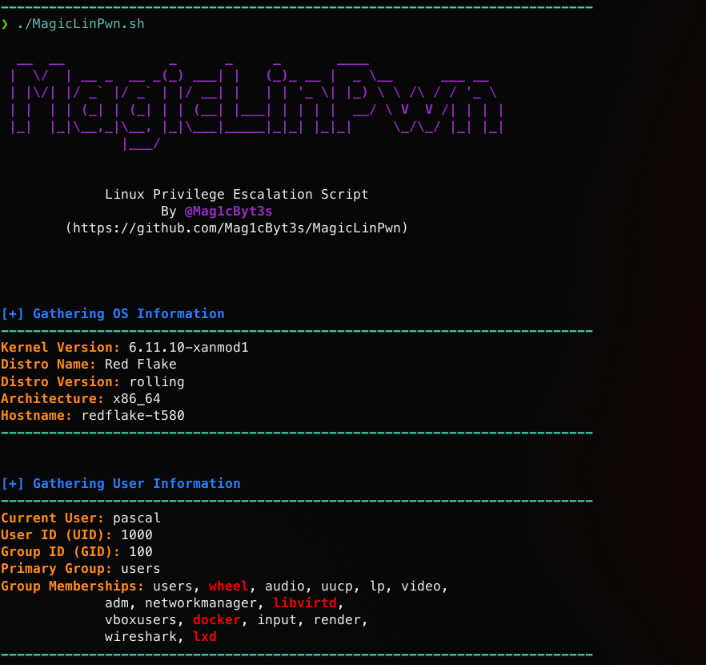

# MagicLinPwn
MagicLinPwn is a powerful and automated Linux privilege escalation script designed to help security professionals and CTF enthusiasts identify potential misconfigurations, vulnerabilities, and weaknesses that can lead to privilege escalation.

## Usage
```bash
./MagicLinPwn.sh
```

<br>

## Features

- **OS Information Gathering**:
  - Detects and displays the operating system, kernel version, architecture, and hostname.
- **User and Group Information**:
  - Displays the current user, UID, GID, primary group, and group memberships with line wrapping and highlighting for critical groups (e.g., `wheel`, `sudo`, `docker`, `lxd`).
- **Sudo Privileges Check**:
  - Checks if `sudo` is installed, displays the sudo version and if the user can execute `sudo` commands without a password.
  - Highlights critical configurations such as `ALL`, `NOPASSWD`, and `SETENV`.
- **SUID Binary Check**:
  - Finds and lists all binaries with the SUID bit set.
  - Highlights potentially dangerous binaries (e.g., interpreters like `bash` or `python`).
  - Includes a timeout mechanism to skip the check if it takes too long.
- **SGID Binary Check**:
  - Finds and lists all binaries with the SGID bit set.
  - Highlights potentially dangerous binaries (e.g., `mail`, `write`, `wall`).
  - Includes a timeout mechanism to skip the check if it takes too long.
- **Cron Job Analysis**:
  - **System-Wide Cron Jobs**: Lists cron jobs from `/etc/cron.d` and their contents.
  - **User-Specific Cron Jobs**: Checks the current user’s crontab for entries.
  - **/etc/crontab Analysis**: Displays the contents of `/etc/crontab` and checks if it is writable.
  - **Writable Cron Files**: Identifies writable cron files across `/etc/cron*` directories and highlights potential security risks.
- **Capabilities Check**:
  - Finds and lists all files with Linux capabilities.
  - Highlights potentially dangerous capabilities (e.g., `cap_setuid`, `cap_net_raw`, `cap_dac_override`).
  - Includes a timeout mechanism to skip the check if it takes too long.
- **Writable Critical Files and Directories Check**:
  - Checks critical system files (e.g., `/etc/passwd`, `/etc/shadow`, `/etc/sudoers`) for write permissions.
  - Checks critical directories (e.g., `/etc/sudoers.d`, `/etc/cron.d`) for write permissions and scans for writable files within them.
  - Highlights writable files and directories as potential security risks.
  - Provides clear summary messages when no writable files or directories are detected.

<br>

## Screenshots
